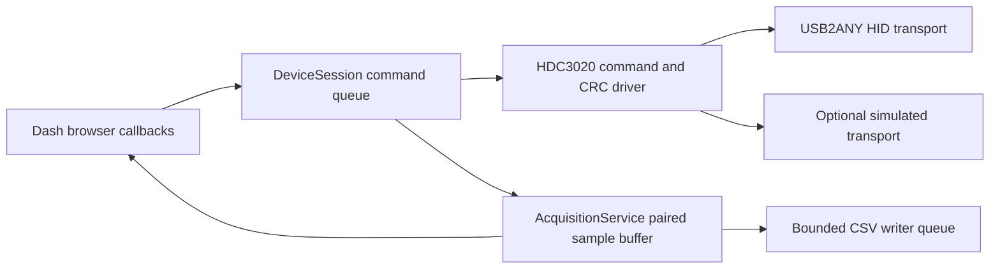

# Architecture

## Ownership

`DeviceSession` is the sole owner of open, initialization, sampling, controls and
close. UI callbacks submit bounded queued commands and read immutable snapshots.
No UI callback enumerates hardware, reads a register or touches a HID handle.
Disconnect rejects new commands, cancels queued requests, waits for the in-flight
operation, attempts heater-off/exit-auto, then closes. A new connection cannot
start while its predecessor is alive. Control failures invalidate the session;
an uncertain write is never automatically replayed.

`sensors.py` handles 16-bit HDC commands, timing and sensor-level CRC. `usb_hid.py`
handles HID envelopes, bridge CRC, reply sequence/command/type checks, raw I2C
and bounded I/O. `protocol.py` is pure. The simulator implements the same byte
transport interface, so UI simulation exercises the production driver.

`AcquisitionService` accepts only complete validated measurement pairs. It assigns
UTC timestamps/monotonic sequence numbers under a lock, stores a bounded deque,
and submits immutable samples to `CsvRecorder`. Acquisition uses monotonic
deadlines, skips missed slots rather than catching up in bursts, and treats three
consecutive acquisition errors as session failure. Buffer clearing does not reset
sequence numbers or modify existing files. Both sources can appear in a buffer
across reconnects; each sample retains its source and configuration.

CSV writes and flushing occur on a separate worker. Queue overflow and disk
failure count lost rows and expose an error. Stop blocks acceptance, drains
accepted rows and joins the writer. Download is unavailable while the writer is
alive, including after a stop timeout. A process crash cannot promise durability
beyond the OS filesystem cache; this is a local monitor, not a transactional logger.
With auto-save selected, the session's successful connection starts the CSV
writer before the first sample. A failed connection creates no automatic file.
The writer rotates on the first accepted sample of each new UTC day, so a pause
across midnight produces the next file only when sampling resumes. The UI shows
the current file, cumulative row/file counts, drops and writer errors. Disconnect
or unexpected session termination drains and closes the writer. Opting out leaves
the manual Record/Stop controls available.

## UI reuse

The TMP monitor's Dash layout, CSS, monitor/settings tabs, live-follow behavior,
local-time axis conventions, CSV worker and USB packet framing are adapted here.
Paired readings and stacked shared-X plots replace the single-temperature view.
Settings are basic volatile commands rather than TMP register/EEPROM editors.
All clients share one process/session. Browser closure alone does not stop a session;
Stop/Disconnect or terminate the Python process gracefully.

## Heater

Only minimum-element 5-second pulses are exposed. The device worker checks the
deadline even while acquisition is paused; another pulse cannot extend the active
deadline. Each paired reading includes heater status read from the sensor.
Orderly shutdown attempts heater-off first. USB timeout, host scheduling delays,
process kill or loss of communication can delay/prevent shutoff. No software timer
is presented as a hardware safety guarantee; the recovery is physical power removal.
