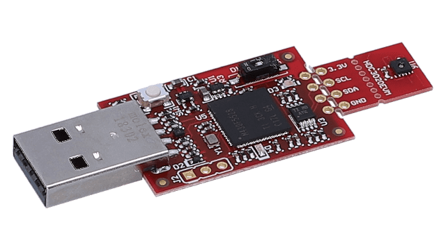
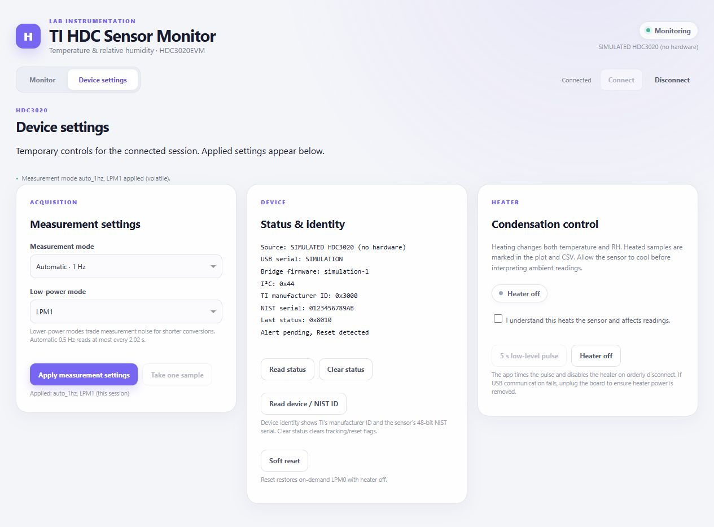

# TI HDC Sensor Monitor

Watch temperature and relative humidity together, explore synchronized history, and
save paired measurements to CSV. The dashboard runs locally in your browser, with
Python handling the **TI HDC3020EVM** through USB / USB2ANY HID.



*TI HDC3020EVM temperature and humidity evaluation board.*

Modeled on [ti-tmp-sensor-monitor](https://github.com/cct1123/ti-tmp-sensor-monitor)
using the same Dash interface conventions and single-session architecture.

**Status:** physical acquisition, CSV, live dashboard, volatile controls and one
bounded test of the sensor's optional integrated heater passed on HDC3020EVMs.
Automatic CSV start and daily rotation passed software/simulator checks and
await review before a new physical check. Independent temperature/RH accuracy
was not calibrated. See the
[validation report](outputs/REPORT.md) and [current checkpoint](STATE.md).

## Quick start

Install [uv](https://docs.astral.sh/uv/getting-started/installation/), then open
Bash (Git Bash on Windows) in this repository. With one HDC3020EVM connected
and TI's GUI closed, run:

```bash
uv run --extra usb python app.py
```

Open [the dashboard](http://127.0.0.1:8050/) and follow the
[five-step guide](docs/quick-start.md) to monitor, record and disconnect.
For simulation without hardware, run `uv run python app.py --simulate`.

The USB backend supports 64-bit Python through hidapi; it does not require
`USB2ANY.dll`, TI Cloud Agent, or TI's GUI. Installation downloads dependencies;
monitoring serves assets locally and binds only to loopback. Run one app process
per board. All browser tabs share that process's device session and recorder.

## Monitor and browse history

- **Connect** opens and identifies the device without sampling. It establishes
  on-demand LPM0 with the heater off; these are volatile changes.
- **Start monitoring** connects automatically or resumes. The default is a fresh
  paired conversion each second and automatic CSV capture. Uncheck **Save CSV
  automatically while monitoring** before starting for a quick view without a
  file. **Stop** pauses host acquisition; **Disconnect** drains the CSV, attempts
  heater-off and exit-auto, then releases the board.
- Live values show the last sample timestamp. Disconnected/paused readings are
  explicitly marked as retained. Statistics cover the entire 7,200-sample buffer.
- The two plots share their time range. Drag or zoom either plot; **Follow live**
  returns to the last five minutes. **Clear data** clears only the in-memory buffer.

See the [history walkthrough](docs/usage-guide.md#2-browse-history-and-return-to-live)
for how to hold a time range and return to live following.

## Record, download, and export

1. Leave **Save CSV automatically while monitoring** checked. After a successful
   **Start monitoring**, new samples go to `recordings/`. The writer opens a new
   file on the first sample of each UTC day; older files remain in that folder.
2. Watch the current filename, total written rows, file count and dropped rows in
   **CSV recording**. **Stop** pauses sampling while leaving the file open.
3. Click **Stop recording** to close the file while monitoring continues, or
   **Disconnect** to drain it and release the board. **Download last CSV** is
   available after the writer closes and downloads the most recent file.
4. For a quick view without automatic saving, uncheck the option before starting.
   **Record** starts a manual, non-rotating CSV when needed. **Export buffer**
   saves only the samples currently held in memory.

Recording starts with new samples; it does not include earlier history. **Stop**
pauses acquisition but leaves recording armed for a later resume. **Clear data**
does not erase files. Disk errors and dropped rows remain visible.

CSV pairs both channels with UTC timestamps, raw values, source and measurement settings.
Plots use the computer's local time. Heater-on readings are marked in plots and CSV.
See [CSV columns and behavior](docs/usage-guide.md#3-record-and-export-csv) for details.

## Device settings

Both pages remain mounted: changing tabs preserves plots, data, recording and draft controls.
Choose a measurement mode and low-power mode, then click **Apply measurement settings**.
The **Applied** line describes the active configuration; dropdowns are editable drafts.



*Simulator example after applying auto 1 Hz and LPM1. The NIST serial is a simulator
fixture, not a physical board's identity. The heater remains off.*

- Measurement mode: on-demand, auto 1 Hz, or auto 0.5 Hz.
- LPM0 through LPM3 select the noise/power tradeoff.
- **Take one sample** works while paused in on-demand mode.
- Status read/clear, TI manufacturer ID, 48-bit NIST serial, and soft reset.
- A confirmed **5 s low-level heater pulse** and an explicit **Heater off** control.
  Heat changes both measurements, including during cooldown. The host timer is
  best-effort, not a firmware watchdog. If communication fails, unplug the EVM.
- Soft reset restores this app's on-demand LPM0 configuration with heater off.
  EEPROM, offsets, thresholds, firmware and general-call reset are not exposed.

In auto mode, **Stop** pauses reads while the device continues autonomous conversions.
Choose on-demand mode or Disconnect to stop autonomous conversion.
See the [settings walkthrough](docs/usage-guide.md#4-apply-settings-and-check-the-result)
for draft/application behavior and the relationship between mode and sample interval.

## Errors and troubleshooting

The [troubleshooting table](docs/usage-guide.md#troubleshooting) covers missing/busy
boards, failed reads, recording problems and held plots. Bad pairs are discarded;
three consecutive failures close the session. Failed control operations disconnect
immediately because a timed-out write may have taken effect. Resolve the error and
reconnect explicitly. Cleanup failures remain visible; never assume a failed
heater-off command succeeded.

## Verification

```bash
uv run --locked --extra usb --extra dev python -m unittest discover -s tests -v
uv run --locked --extra usb --extra dev ruff check .
uv run --locked python -m hdcsensor.validate --samples 30
```

The last command checks acquisition/CSV/reconnect in **simulation**. For the
approved physical test procedure and its results, see
[hardware validation](docs/hardware-validation.md) and the
[validation report](outputs/REPORT.md). One attended heater pulse was validated
under H015; no further pulse is authorized by that result. The automatic-CSV
candidate still awaits its separate non-heater physical check.

## Documentation and references

- [Quick start](docs/quick-start.md): five steps from connection to CSV download.
- [Usage guide](docs/usage-guide.md): history, CSV, settings and recovery.
- [Architecture](ARCHITECTURE.md): device ownership and background workers.
- [Protocol](docs/protocol.md): HID framing, raw I²C, commands, CRC and conversion.
- [HDC3020EVM](https://www.ti.com/tool/HDC3020EVM), [EVM user guide](https://www.ti.com/lit/pdf/snau267),
  and [HDC3020 datasheet](https://www.ti.com/lit/gpn/hdc3020).

Read [PROJECT.md](PROJECT.md) for intent, [STATE.md](STATE.md) for current evidence
and next action, and [AGENTS.md](AGENTS.md) for the engineering loop/review gate.
Licensed under [MIT](LICENSE). Adaptation credits are in [NOTICE.md](NOTICE.md).
