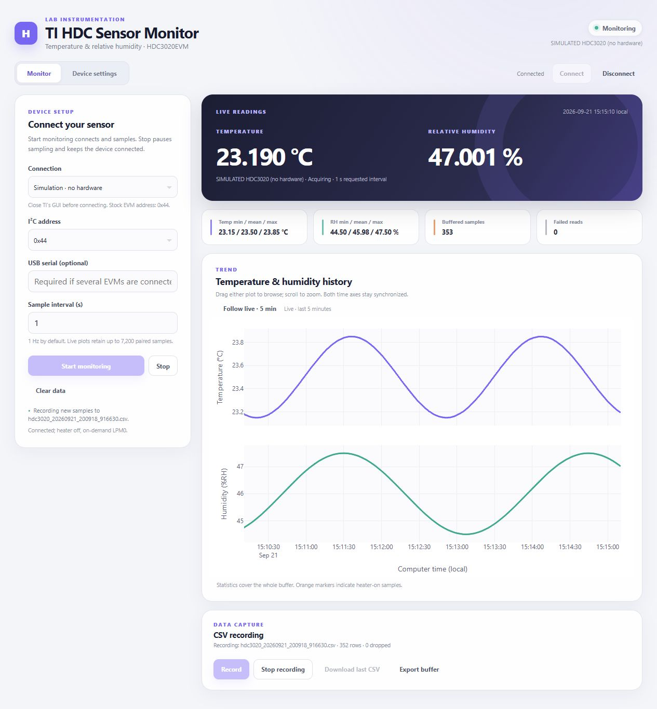

# Quick start

Install [uv](https://docs.astral.sh/uv/getting-started/installation/) once, then
open Bash (Git Bash on Windows) in this repository. `uv run` manages the project
environment and USB dependency for you.

1. Connect one HDC3020EVM by USB and close TI's EVM GUI.
2. Start the dashboard:

   ```bash
   uv run --extra usb python app.py
   ```

3. Open [http://127.0.0.1:8050/](http://127.0.0.1:8050/). Select **USB /
   USB2ANY HID**, address **0x44**, interval **1 s**, then click **Start
   monitoring**. The temperature and humidity readings should update together;
   **Failed reads** should stay at zero.
4. To save data, click **Record**. When finished, click **Stop recording** →
   **Download last CSV**. **Export buffer** also includes readings from before
   recording started.
5. Click **Stop** → **Disconnect**, then press **Ctrl+C** in Bash. Closing the
   browser tab alone does not release the board.



To try the interface without a board, run `uv run python app.py --simulate` and
select **Simulation · no hardware**. For plots, settings and troubleshooting,
see the [illustrated guide](usage-guide.md). Leave the heater off on a first
run; its physical pulse has not been validated ([current status](../STATE.md)).
