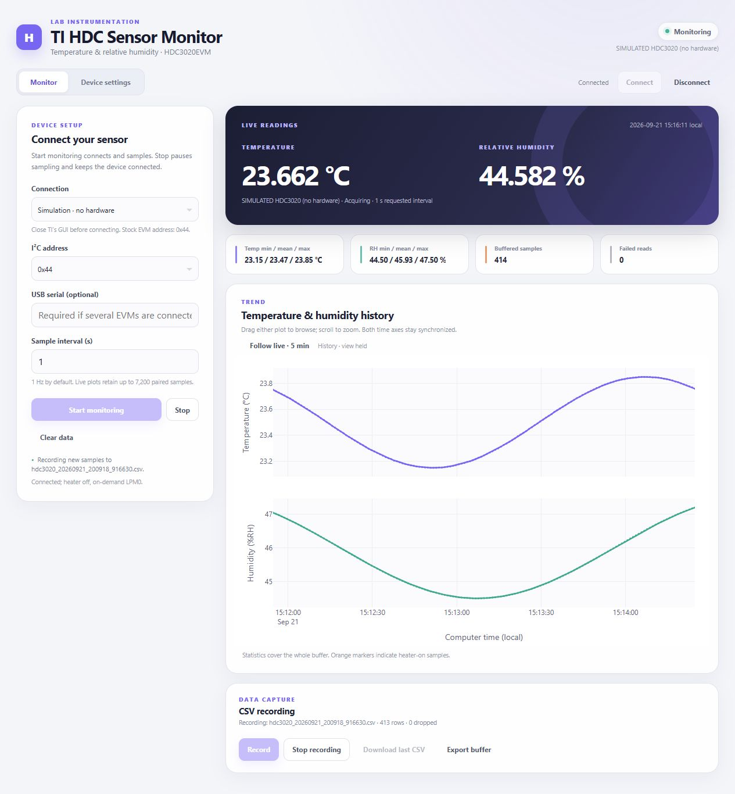
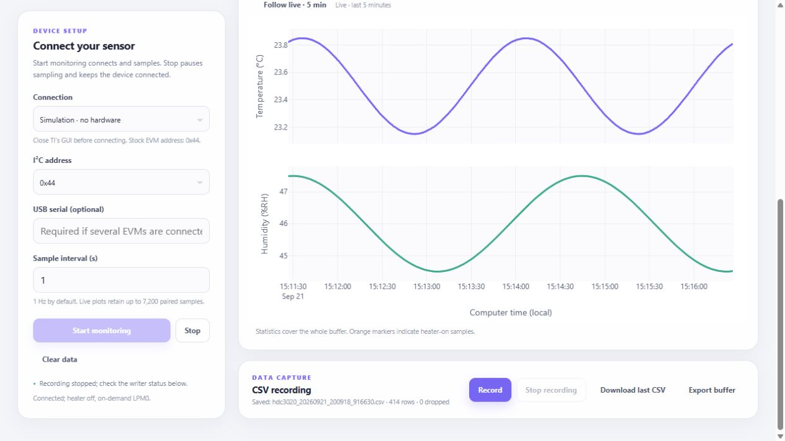

# Illustrated usage guide

Follow **start → inspect → record → adjust settings → disconnect**. Screenshots were
captured from this application's simulator on Windows. Values, USB identity and
NIST serial in the images are simulated; physical validation is pending.

## 1. Start your first session

From the repository folder, run:

```powershell
uv run python app.py --simulate
```

Open [the dashboard](http://127.0.0.1:8050/), confirm **Simulation · no hardware**,
and click **Start monitoring**. The header changes to **Monitoring**, the source reads
**SIMULATED HDC3020 (no hardware)**, and the temperature/RH pair updates about once a second.


Check these four places:

1. **Source and connection** identify which backend is active.
2. **Live readings and timestamp** show the latest complete temperature/RH pair.
3. **Buffered samples / Failed reads** show acquisition progress and errors.
4. **CSV recording** shows whether new samples are being saved.

Statistics cover the whole buffer. Up to 7,200 pairs are retained, about two hours
at the default interval; older pairs roll out as new ones arrive. **Clear data** clears
the buffer and statistics but does not remove recordings.

For a physical board, install with `uv sync --extra usb`, launch with
`uv run --extra usb python app.py`, close TI's GUI, and choose **USB / USB2ANY HID**
with stock address **0x44**. **Connect** initializes on-demand LPM0 and heater-off
without sampling. **Start monitoring** connects and acquires. The hardware path awaits
approval under the [hardware validation procedure](hardware-validation.md).

## 2. Browse history and return to live

The upper plot shows temperature and the lower plot shows relative humidity.
Their time axes remain synchronized, so changes can be compared at the same instant.

1. Drag either plot horizontally to browse earlier samples.
2. Scroll over a plot to zoom, or use its **Zoom in / Zoom out** toolbar controls.
3. Look for **History · view held**. Acquisition continues, but the selected time
   range stays fixed while new samples arrive.
4. Click **Follow live · 5 min** to restore the latest five-minute view.



*History · view held identifies a selected range. Both plots use the same time range;
statistics still describe the entire buffer.*

**Stop** pauses acquisition. The last values and timestamp remain visible, labeled
as retained. **Start monitoring** resumes. In auto mode, Stop pauses host reads only;
the sensor keeps converting until on-demand mode is selected or you Disconnect.

## 3. Record and export CSV

Click **Record** while monitoring. New samples go to a timestamped file such as
`recordings/hdc3020_YYYYMMDD_HHMMSS_ffffff.csv`. Earlier samples are available through
**Export buffer**, but are not backfilled into the recording.

Click **Stop recording** to finish the file. The writer drains accepted rows before
**Download last CSV** becomes available. Confirm **Saved**, the written-row count,
and **0 dropped** before using the recording.



| Action | Data included | Effect on recording |
| --- | --- | --- |
| **Record** | New samples after recording starts | Starts a new file. |
| **Stop recording** | All rows accepted before stopping | Drains and closes the file. |
| **Download last CSV** | The latest completed recording | None. |
| **Export buffer** | A snapshot of all currently buffered pairs | None. |
| **Clear data** | Removes buffered pairs from the UI | The file remains; recording can continue. |

Each row keeps both channels from the same conversion:

| Columns | Meaning |
| --- | --- |
| `timestamp_utc`, `sequence` | UTC timestamp and increasing sample number. Clearing the buffer does not reset the sequence. |
| `temperature_c`, `relative_humidity_pct` | Converted temperature in °C and humidity in %RH. |
| `source` | USB or explicitly labeled simulator source. |
| `raw_temperature`, `raw_humidity` | Unsigned 16-bit sensor words after CRC validation. |
| `mode`, `low_power` | Active measurement mode and LPM0–3 for that pair. |
| `heater_on` | `1` when heater status was on, otherwise `0`. Cooldown effects are not captured by this flag. |

Plots display local time. CSV timestamps use UTC with the `+00:00` offset. Incomplete
or CRC-failed pairs are discarded. Queue overflow and disk errors appear in the UI;
a file with dropped rows or a writer error is not a complete capture.

## 4. Apply settings and check the result

Switch to **Device settings** while connected. Monitoring and recording continue
across tab changes, and editable controls retain draft values.

1. Select a **Measurement mode** and **Low-power mode**.
2. Click **Apply measurement settings**.
3. Check the completion message and **Applied** line. Selecting a dropdown alone
   does not change the device.


*Applied: auto_1hz, LPM1. The simulator's NIST serial is a fixture. No physical
device was contacted for this screenshot.*

| Mode | Acquisition behavior |
| --- | --- |
| **On demand** | Each host sample triggers and waits for a new conversion. Default: one pair every second. |
| **Automatic · 1 Hz** | The sensor converts autonomously; host fetch spacing is at least 1.02 s. |
| **Automatic · 0.5 Hz** | The sensor converts autonomously; host fetch spacing is at least 2.02 s. |

A longer requested sample interval slows host reads further. LPM0 has the lowest
noise; LPM1–3 trade noise for lower power and shorter conversions. Settings are volatile.

**Take one sample** requires paused monitoring and on-demand mode. **Read status**
refreshes flags; **Clear status** clears tracking/reset flags. **Read device / NIST ID**
shows TI manufacturer ID `0x3000`, a 48-bit sensor NIST serial, bridge firmware and USB
serial. The manufacturer word is not an HDC-specific model identifier.

**Soft reset** restores the app's on-demand LPM0 defaults and heater-off state.
It does not make current dropdown drafts the active configuration.

### Heater control

Acknowledge **I understand this heats the sensor and affects readings**, then request
**5 s low-level pulse** only when heating is appropriate. The app uses the minimum
heater element; **Heater off** requests disable on the device worker. Orange plot
markers and `heater_on=1` identify heater-on samples, which remain in statistics.
Allow cooldown before interpreting ambient readings.

The host timer runs even while sampling is paused. USB failure or a stopped host
cannot guarantee shutdown: unplug the board if heater-off is uncertain. Physical
heater testing requires explicit scope under the hardware gate. These screenshots
keep the heater off.

## 5. Finish a session

1. Click **Stop recording** and wait for **Saved**.
2. Download the file if needed.
3. Click **Disconnect** to attempt heater-off/exit-auto and release the device.
4. Stop the server with **Ctrl+C** in its terminal.

Closing a browser tab does not stop the Python process or its session. **Stop** alone
also keeps the device open. Disconnect before opening TI's GUI or another hardware
test. If cleanup fails, resolve the error and unplug the EVM when shutdown is uncertain.

## Troubleshooting

| Symptom | Next step |
| --- | --- |
| No USB2ANY/OneDemo EVM found | Check USB and close TI's GUI. Confirm board/firmware assumptions in the [protocol notes](protocol.md); do not flash firmware as a shortcut. |
| Multiple compatible boards found | Connect one board or enter its USB serial before connecting. |
| Missing HID dependency | Run `uv sync --extra usb`, then `uv run --extra usb python app.py`. |
| CRC, NAK or failed reads | Check connection, address and device ownership. Three consecutive failures close the session; reconnect after resolving the cause. |
| A settings command fails | The session closes because a timed-out write may have taken effect. Reconnect to establish known state. |
| Download last CSV is disabled | Start a recording, stop it, and allow the writer to finish. Inspect writer errors if it stays unavailable. |
| Old values remain visible | Check timestamp and connection. Pausing/disconnecting retains history; it does not imply new acquisition. |
| Plots stopped following data | Click **Follow live · 5 min** to leave the held range. |
| Default port is busy | Use `uv run python app.py --simulate --port 8051` and open `http://127.0.0.1:8051/`. Never run two processes against one board. |

## Installation without uv

Use Python 3.9 or newer; the checked environment is Python 3.12 on Windows:

```powershell
python -m venv .venv
.\.venv\Scripts\python -m pip install "dash>=2.18,<4" "hidapi>=0.15,<1"
.\.venv\Scripts\python app.py --simulate
```

Omit `--simulate` when preparing to connect USB hardware. Simulator preselection
does not prevent a user from deliberately selecting USB later.

[Back to README](../README.md) · [Validation evidence](../outputs/REPORT.md)
